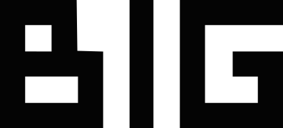
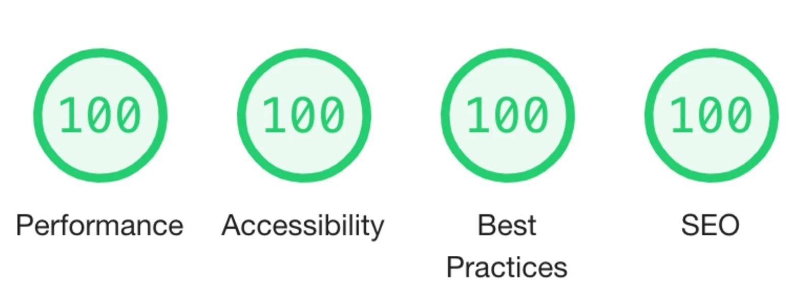

<!-- REPO TITLE -->
<br />
<p align="center">
  

  <h4 align="center">Bjarke Ingels Group | Clone (client)</h4>
  <p align="center">
    <a href="https://big.dk/" target="_blank">Original</a>
    ·
    <a href="https://big-dk.vercel.app/" target="_blank">Live Demo</a>
  </p>
</p>

<br />
<br />


![product-screenshot]
<!-- ABOUT THE PROJECT -->
## About the clone
The aim of this clone is to improve the [BIG (Bjarke Ingels Group)](https://big.dk/) website which is made with wordpress, a custom plugin and the Canvas API and which lacks of responsiveness, accesibility, performance and SEO based on the lighthouse report.

This clone also helped me to get a workaround to the `flex-direction: column;` [css problem](https://stackoverflow.com/questions/33891709/when-flexbox-items-wrap-in-column-mode-container-does-not-grow-its-width).

About the Headless CMS ([repository](https://github.com/francoromanol/big.dk-clone_server)): This clone — like the original — has its own CMS created with [Strapi](https://strapi.io/) that allows the user to create projects in an easy and fast way, which automatically generates the necessary properties based on the project information (alphabetical, slug, scale) to use them on the client-side.

### Improvements
 <div align="center">
  
 </div>

 * Improved lighthouse report
 * Semantic elements.
 * SEO improved.
 * Responsive design that works with mobile, tablet and desktop.
 * Search bar for projects.
 * Each project has it's own page (SEO improvement) with it's own slug based on the project name provided in the headless CMS.
 * Color contrasts corrected.


### Made with
* [Next.js](https://nextjs.org/)
* [styled-components](https://styled-components.com/)
* [Axios](https://axios-http.com/)
* [react-easy-flip](https://github.com/jlkiri/react-easy-flip)
* [react-spring](https://react-spring.io/)
* [Vercel](https://vercel.com/) for deployment.
* [Strapi](https://strapi.io/) as a Headless CMS => [repository](https://github.com/francoromanol/big.dk-clone_server)


### Installation and start
To get a local copy up and running follow these steps:

1. Clone this repo and headless cms repo
   ```sh
   $ git clone https://github.com/francoromanol/big.dk-clone_client.git 
   $ git clone https://github.com/francoromanol/big.dk-clone_server.git
   ```
2. Install packages on client and headless cms
   ```sh
   $ yarn install
   ```
3. In `.env.local` file (client)
    ```sh
    CMS_HOST= [CMS HOST]
    CMS_LOCALHOST= 'http://localhost:1337'
    NEXT_PUBLIC_CMS_LOCALHOST=$CMS_LOCALHOST
    ```
4. Run client and headless cms
    ```sh
    $ yarn dev # client
    $ yarn develop # headless cms
    ```

Once started the client app should be available via [localhost:3000](http://localhost:3000) and the headless cms via [localhost:1337](http://localhost:1337)


### Have a great day!

<!-- MARKDOWN LINKS & IMAGES -->
<!-- https://www.markdownguide.org/basic-syntax/#reference-style-links -->
[product-screenshot]: readme/recording.gif
